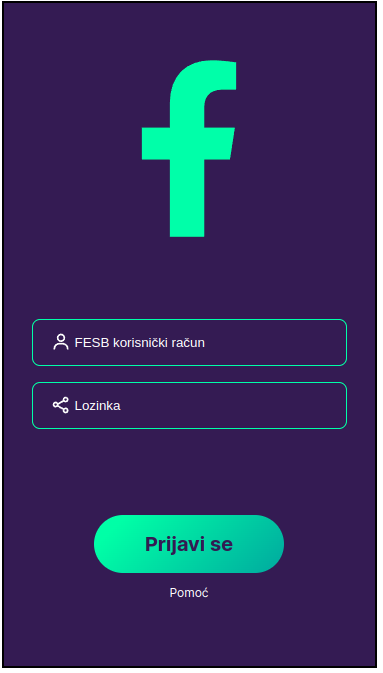
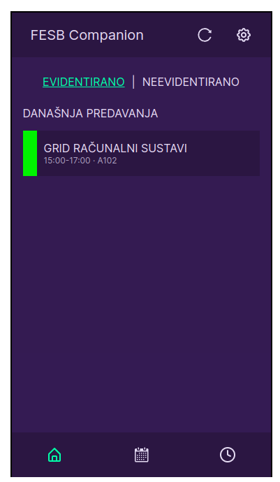
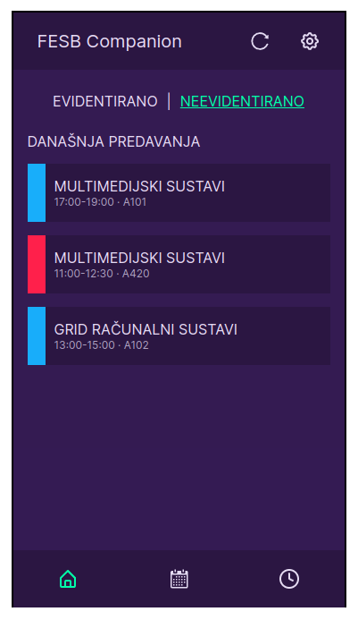
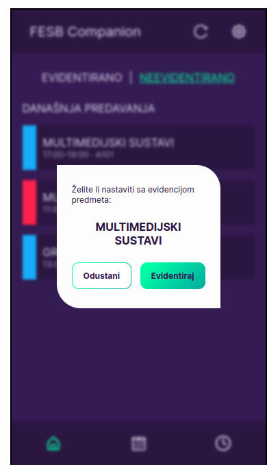
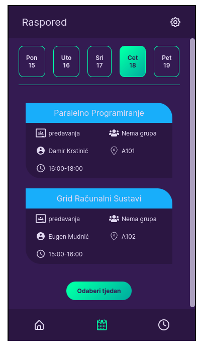
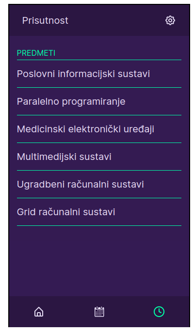
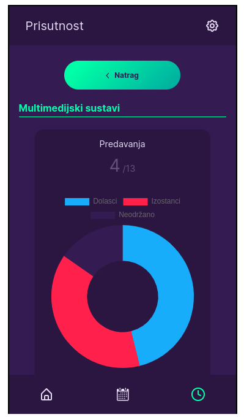
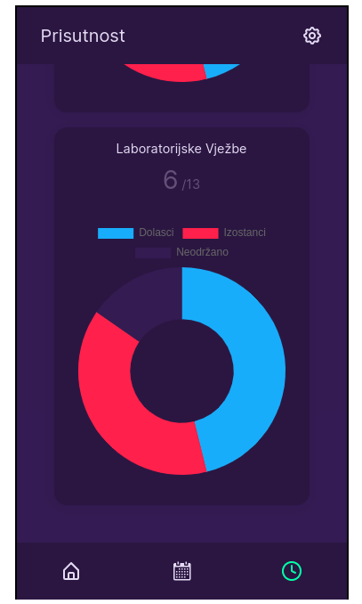

# FESB-Companion

## Technology used:

- React JS
- HTML/CSS
- React Router
- API created with Node.js

---

## Users should be able to:

- Log in with their FESB accounts
- See their week schedule and filter by day
- See their presence and filter by subject
- make a record for the subject for today's date

## Screenshots

---

### Login Page

## 

---

### Home Page

## 

## 

## 

---

### Calendar Page

## 

### Presence Page

## 
## 
## 

